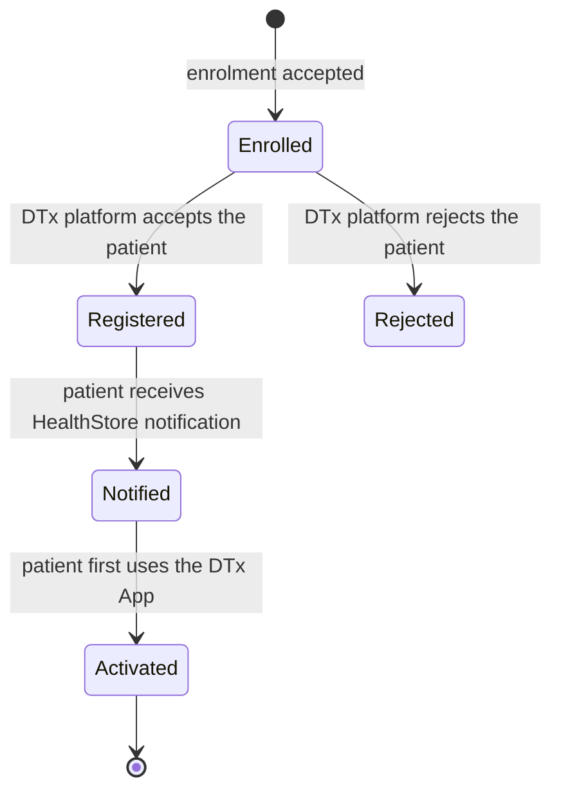
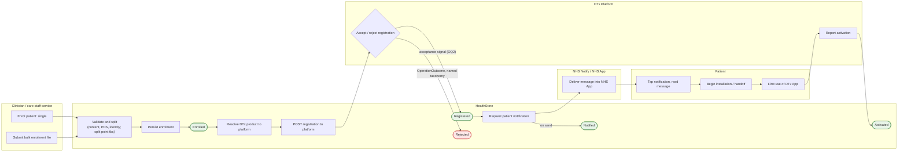

# End-to-end process description — enrolment through activation

Describes the full end-to-end process for a patient entering HealthStore and
beginning treatment on a digital therapeutic: enrolment, registration,
HealthStore patient notification, activation. The scope stops at activation;
deactivation, withdrawal and completion are held as open questions.

The document separates three things deliberately:

1. **Logical states** of a single enrolment in its lifecycle, defined without
   reference to any implementation.
2. **Logical events**, the things that happen in the world that justify a state
   change.
3. **Implementation specifics**, the actions and mechanisms (API calls, queues,
   notifications) that detect or perform those events and effect the transitions.

States are the durable truth HealthStore owns. Events justify transitions.
Implementation carries events; it never defines them.

## Domain terminology

| Term | Definition |
|---|---|
| Patient | An NHS patient. |
| HealthStore | The NHS service through which commissioning bodies procure DTx products and clinical staff enrol patients onto them. Not a store from which patients obtain DTx apps. |
| DTx Platform | The full supplier service for a digital therapeutic: its APIs, clinician portal and backend. The integration counterparty. |
| DTx App | The patient-facing mobile app for treatment, provided by the DTx platform. |
| Enrolment | A clinician or care-staff action that enrols a patient for treatment of a care pathway into HealthStore. The unit whose lifecycle this document describes. |
| Registration | The act of HealthStore registering an enrolled patient onto the DTx platform that serves the prescribed product. |
| HealthStore patient notification | The notification HealthStore causes to be delivered to the patient, via NHS Notify into the NHS App, telling them about the digital therapeutic and giving them the route into it. Named explicitly to distinguish it from any notification the DTx sends. |
| Activation | The patient has begun using the DTx App. Reported by the DTx platform to HealthStore, linked to the registration. What precisely constitutes "first use" is an open question. |
| NHS App | The NHS patient-facing app. Receives the HealthStore patient notification into Messages and hosts the screen from which the patient starts the installation / handoff flow. |
| NHS Notify | The NHS service that delivers the HealthStore patient notification. |
| Installation / handoff flow | The flow the patient starts from the NHS App screen that takes them into obtaining and entering the DTx App. Mechanics tbc. |

## Logical lifecycle of a single enrolment

Declared independently of any transport, API or vendor. Every enrolment is in
exactly one of these states.

| State | Meaning |
|---|---|
| Enrolled | HealthStore has accepted the enrolment. The patient is in the service for the care pathway, attached to a DTx product. Nothing has yet been asked of the DTx platform. |
| Registered | The DTx platform has accepted the patient onto its platform. |
| Rejected | The DTx platform refused the registration. Terminal pending a re-registration policy (open question). |
| Notified | The HealthStore patient notification has been sent. Notified is entered on send; delivery and read receipts are a reporting / engagement concern and do not affect orchestration. |
| Activated | The patient has begun using the DTx App and the DTx platform has reported it. |

Ordering constraint carried by this lifecycle: the patient must receive the
HealthStore patient notification before receiving any notification from the
digital therapeutic. Notified therefore sits between Registered and Activated,
and the DTx platform ideally should not communicate with the patient in the
Registered-but-not-Notified window. In that window the patient is considered
not to have installed the DTx App, so an in-app notification is unlikely to
reach them; the channels of concern are others the platform may hold from the
registration data (for example SMS or email). How the ordering is achieved is
an open question.

## Logical events

The happenings that justify each transition, still implementation-free.

| Event | Transition it justifies |
|---|---|
| Enrolment received | entry into validation (pre-lifecycle) |
| Enrolment accepted | → Enrolled |
| Registration accepted | Enrolled → Registered |
| Registration rejected | Enrolled → Rejected |
| Notification sent | Registered → Notified |
| First use occurred | Notified → Activated |

Events that occur but drive no transition (MI-only candidates, to be run through
the event-triage exercise): enrolment validation failures, notification
delivery and read receipts (reporting / engagement), repeated first-use
reports after Activated.

## The process, end to end

The flow below shows the activities in actor lanes with the lifecycle states
embedded as milestones. Every state milestone sits in the HealthStore lane:
HealthStore owns the durable truth, other actors only feed events into it.
Rounded green nodes are states, rectangles are activities; open questions are
carried on the edges where they apply (OQ numbers refer to the open questions
register).

### 1. Enrolment

Enrolments may arrive into HealthStore through more than one entry point. The
first is a clinician-facing service supporting both singular and bulk
enrolment; adapters from core NHS systems remain a potential further entry
point. For bulk, the conception is a file (CSV) landed to storage with a
validation phase over it: file-content correctness checks, PDS lookup, identity
verification, then fan-out into individual enrolments. Where in the chain bulk
is split into singles is tbc.

Whatever the entry point, the outcome is uniform: each patient-level enrolment
that passes validation is persisted by HealthStore and enters the lifecycle as
Enrolled. Entry points differ in arrival and validation mechanics only; from
Enrolled onward every enrolment is indistinguishable.

### 2. Registration

HealthStore resolves the enrolment's DTx product to the platform that serves it
and registers the patient by POSTing a FHIR resource to that platform's
registration API. The platform's acceptance moves the enrolment to Registered;
a refusal moves it to Rejected with a reason from a named rejection taxonomy.

Acceptance semantics are a held-open decision: either the synchronous 201 alone
means Registered (bare acknowledgement), or a two-layer model in which the 201
means received and a subsequent supplier callback means accepted, as Home-Test
does. The logical lifecycle is unaffected by the choice; only which
implementation signal justifies the Registration-accepted event changes.

### 3. HealthStore patient notification

On (or after) Registered, HealthStore causes the patient notification to be
sent via NHS Notify, delivered into the NHS App. The patient experiences it as
a native device notification; tapping routes them to Messages in the NHS App.
The message links to the relevant screen within the NHS App carrying details of
the digital therapeutic, from which the patient can tap a link to begin the
installation / handoff flow.

This notification is the patient's route into the DTx App. It must land before
any DTx communication reaches the patient.

### 4. Activation

The patient completes the installation / handoff flow and begins using the DTx
App. On first use, the DTx platform reports the activation to HealthStore by
POSTing to a HealthStore-provided API, linked to the registration. HealthStore
moves the enrolment to Activated. The handoff flow is expected to carry the
correlation the DTx App needs to link first use back to the registration;
mechanics tbc.

## Implementation augmentation — actions effecting each transition

| Transition | Performed by | Mechanism |
|---|---|---|
| (arrival) → Enrolled | Entry point + HealthStore validation | Clinician service submits single, or bulk file to storage; validation (content checks, PDS lookup, identity verification); fan-out to per-patient enrolments; persist. |
| Enrolled → Registered | HealthStore outbound, DTx platform decides | HealthStore POSTs FHIR registration resource to the platform's API (internal queue fronting the POST for durability). Acceptance signal per the open acceptance-semantics decision. |
| Enrolled → Rejected | DTx platform | Synchronous rejection (4xx/409 OperationOutcome, named taxonomy) or callback, per the same decision. |
| Registered → Notified | HealthStore via NHS Notify | Notify request; state entered on send. Delivery into NHS App Messages follows; delivery and read receipts are reporting / engagement only. |
| Notified → Activated | DTx platform inbound | DTx platform POSTs activation (FHIR) to the HealthStore API on first use, carrying the registration correlation. Idempotent on repeats. |

## Open questions

1. Deactivation, withdrawal, completion: whether the lifecycle extends beyond
   Activated, which party may initiate each, and whether HealthStore ever calls
   the DTx platform to deactivate.
2. Acceptance semantics for registration: bare 201 vs two-layer
   received/accepted. Bound up with the NFRs around registration process
   times: what timeliness is required from enrolment through Registered (and
   on to Notified), and whether those expectations change when batches are
   processed. A bare 201 puts the whole registration inside one synchronous
   exchange and its latency budget; two-layer tolerates slower supplier-side
   completion but leaves the enrolment in a received-but-not-accepted interim
   the NFRs must bound. NFR values are an external input, carried as tagged
   assumptions until supplied.
3. How the notification-before-DTx-comms ordering is achieved: contractual
   obligation on the platform, structural (the un-installed patient is
   unreachable in-app, so the exposure is limited to out-of-app channels such
   as SMS or email built from registration data), or both. Includes whether
   registration data should even give the platform out-of-app contact routes
   before activation.
4. Definition of "first use", and behaviour on reinstall / multiple devices
   re-reporting it.
5. Re-registration policy after Rejected.
6. Where bulk is split into singles, and bulk lifecycle / partial-failure
   semantics (reject bad items and enrol the good, vs reject the batch).
7. Installation / handoff flow mechanics and the correlation it carries into
   the DTx App.
8. Patients who never activate: timeout, chase, clinician visibility.
9. Patient's view in the NHS App: given an enrolment is within HealthStore,
   what should the patient see on the connected apps page, for example a
   status indicator reflecting the lifecycle state and functionality
   differences per state.
10. Withdrawal initiation (refines 1): should the patient be able to request
    withdrawal from within the NHS App, and does a clinician withdraw a
    patient.
