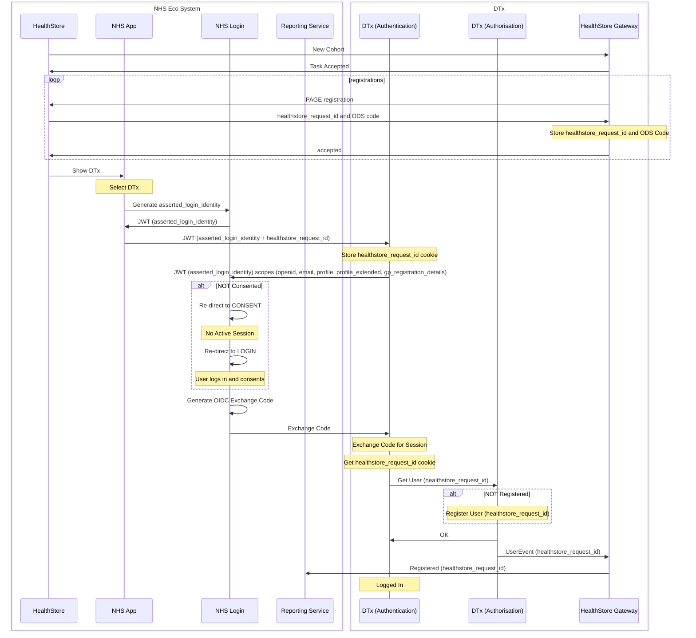

## Detailed Sequence of data flow for deferred creation of accounts
This sequence shows the data flow when account creation within the dtx is postponed until after explicit consent is provided byt he patient.  This proposal will allow the NHS login consent to share data with the dtx, to be the consent for this, as all data required to create the account can be gained from the NHS login claims (with consent drivien by the scope requested) with only the healthstore_request_id as the only additional information required at the point in time the patient has clicked the link to the DTx.

