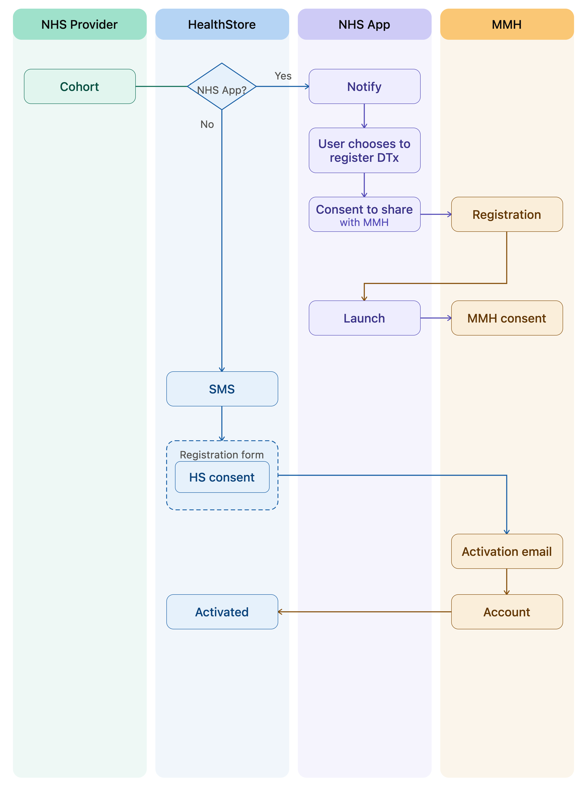
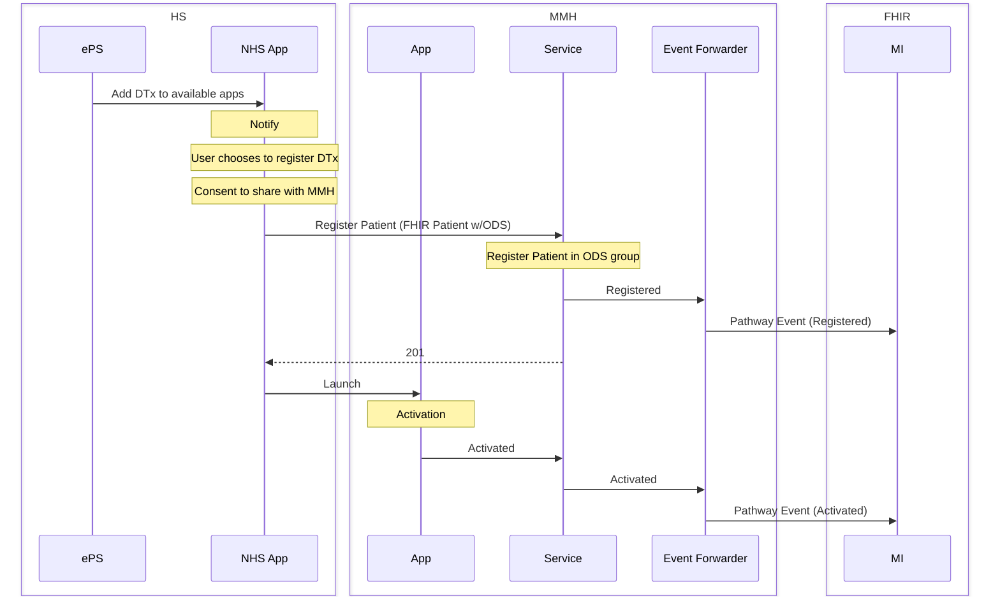

# DTx Onboarding Workflows

The following workflow describes the proposed onboarding process for cohorts of patients to a DTx via the HealthStore. This includes support for patients with and without access to the NHS app. In both scenarios the cohort of patients is identified by the NHS Provider and uploaded to the HealthStore. The HealthStore is responsible for determining if the patient has the NHS App.

## DTx Onboarding - Patient has NHS App

For the NHS app route, patients are sent a NHS Notify message via the NHS App informing them of the availability of the DTx. On choosing to register with the DTx they are asked for their consent to share the necessary details with the DTx provider in order to complete registration. The DTx provider will expose a patient registration API that meets a contract defined by NHSE.  Once the patient has consented to share the registration details with the DTx provider, the registration API is called and the option to launch the DTx from the NHS App is displayed. Once the DTx is launched any DTx specific consent is sought at that stage. 

## DTx Onboarding - Patient does not have NHS App

For the route where the patient does not have access to the NHS App, the HealthStore will send an SMS containing a registration link to a registration form hosted on the HealthStore website. Consent to share the registration details with the DTx provider will be obtained by the HealthStore. Once the patient has given consent the account will be registered in the DTx and an email sent to the patient from the DTx provider to activate their account.  Following account activation the HealthStore will be notified of this event via the FHIR API.

## NHS App Flow Sequence Diagram

The following sequence diagram shows the message flow for onboarding a patient who has the NHS App installed. Pathway events as sent to the FHIR API at key stages in the process.

## Patient Registration API

The follow fields are required for the MMH Patient Registration API:

* First Name
* Surname
* DOB
* Email
* Gender
* NHS #
* App / Condition
* Contact Number - this is required to enable us to contact the user in the event of an issue with the registration

