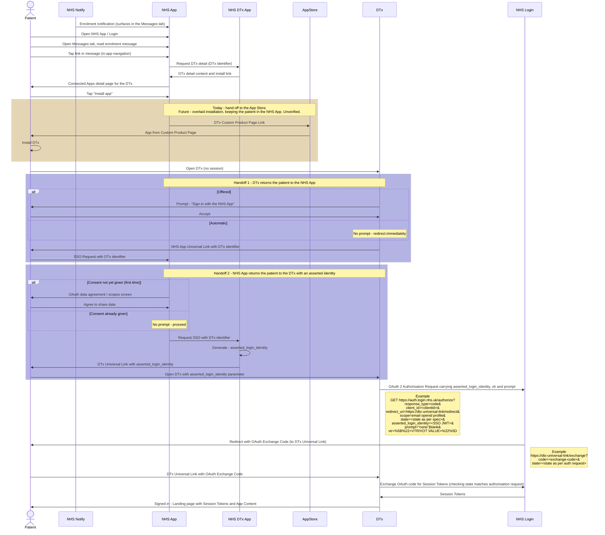

# Patient Flow — Notification to Signed-In DTx

> **The App Store breaks the chain.** Native device navigation into the App Store does not
> carry `asserted_login_identity` through to the installed app. The installed
> DTx therefore starts with no identity and must initiate the handoff itself, returning the patient to the NHS App after install.
>
> **The mechanism is user-agent agnostic.** `asserted_login_identity` is a signed JWT carried
> as a parameter on the authorisation request from RP1 to RP2. NHS Login defines it at that
> level and draws no distinction between a browser and an installed app, so the mechanism is
> unchanged either way. Ref: [NHS Login — Single Sign
> On](https://nhsconnect.github.io/nhslogin/single-sign-on/)
> ([sequence](https://raw.githubusercontent.com/nhsconnect/nhslogin/main/src/images/SequenceDiagram_smaller.png)).
>
> **RP1 to RP2 relationships.**:
>
> | RP1 | RP2 | Where |
> | --- | --- | --- |
> | NHS App | NHS DTx | Within the NHS App, navigating to Connected Apps |
> | NHS DTx | DTx App | Between NHS DTx and a digital therapeutic |

NHS Notify message through to a signed-in DTx session, for a patient without the DTx app
installed.

Participant names follow the existing sequences; `NHS DTx App` is the NHS-side DTx service,
not a patient-facing app.

## Steps

1. NHS Notify delivers the enrolment notification to the **Messages** tab of the NHS App.
2. Patient reads the message and taps its link — in-app navigation to the Connected Apps
   **detail page** for the therapeutic.
3. Patient taps **Install app**.
4. Patient is taken to the App Store custom product page and installs the DTx.
5. Patient opens the DTx. It has no session.
6. DTx directs the patient into the NHS App at a dedicated deep link — offered, or automatic.
7. NHS App returns the patient to the DTx with an `asserted_login_identity` — after an OAuth
   consent screen, or automatic where consent exists.
8. DTx completes the OAuth exchange and signs the patient in.

## Sequence

## Open

- **Agreement-to-share screen.** NHS Login asks the patient user to confirm their agreement to share information. If it is an NHS Login feature: can it be overridden, and
  does `asserted_login_identity` survive the NHS Login flow? Assumption is that it does not
  carry through, which would break the handoff on first run, when consent has not been given.
  Unverified.
- **Offer vs automatic.** Both handoffs are drawn with the choice explicit. Which applies,
  and whether it varies by first versus subsequent launch, is undecided.
- **Overlaid installation.** Future state replaces the App Store handoff with an in-app
  overlay (iOS `SKOverlay`, Android equivalent).
- **Message link target.** Whether the NHS App supports linking a Notify message to a
  specific DTx detail page is unconfirmed but is assumed to be the case.
- **Notify channels.** Only the NHS App message channel is drawn. SMS and email are not
  modelled.
