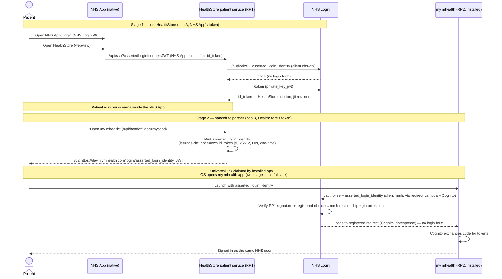

# App-to-app handoff — installed app (DTX-905)

Sequence for launching a patient from the HealthStore patient service into the
installed my mhealth app, signed in, with a single NHS Login. Two asserted
identity issuances, one per hop: NHS App asserts into HealthStore (hop A),
HealthStore asserts into my mhealth (hop B). Trust stays in NHS Login: each
assertion is a 60-second one-time correlation token, verified by NHS Login
against the registered relying-party relationship before any code is issued.

## Notes

- **Assertion shape (both hops)** — NHS Login EIS, authorize request
  extensions: `iss` = minting RP's client_id, `code` = the `jti` of the
  minting RP's own NHS Login id_token, `jti`, `iat`, `exp` ≤ 60s, signed with
  the minting RP's client private key. One-time. No identity claims cross the
  hop; NHS Login resolves the user from the correlated login.
- **Parameter casing** — camelCase `assertedLoginIdentity` on service edges
  (NHS App convention); snake_case `asserted_login_identity` on NHS Login's
  `/authorize`.
- **Relationship config** — RP1→RP2 SSO is enabled by NHS Login per client
  pair (sandpit: `nhs-dtx` → `mmh`, in place and validated).
- **Web fallback** — if the universal link is not claimed on the device, the
  same URL serves my mhealth's web login and the flow completes in the
  browser/webview. This is the variant proven so far.

## Status

| Leg | Status |
|---|---|
| Hop B, web variant (HealthStore web → my mhealth web, code via Cognito) | Proven 2026-06-10, sandpit, real pair |
| Hop A (NHS App → HealthStore `/api/sso`) | Built; to exercise with the NHS App build |
| Hop B, installed variant (universal link opens the installed app) | Pending my mhealth sandbox build with claimed link |
| Webview behaviour (universal-link app switch from inside the NHS App webview) | To prove with the installed variant |
