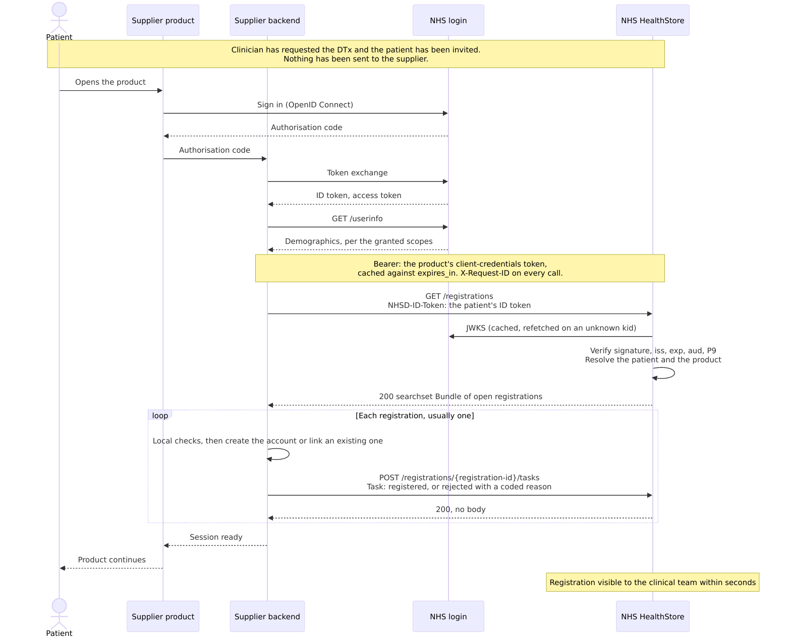
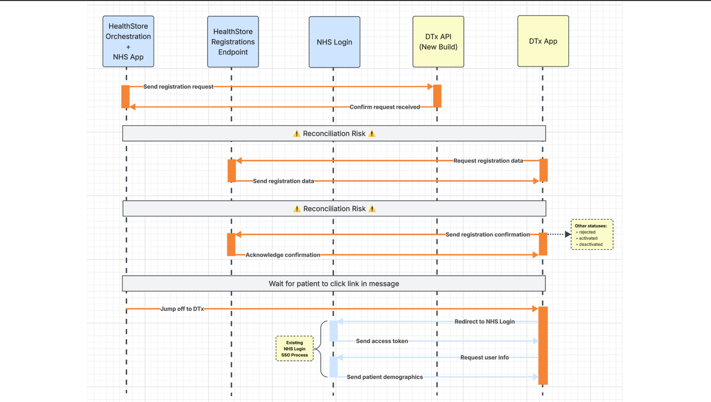

# Registration API v1.0: what changed from the v0.1 draft, and why

*Supplier-facing. Status: baseline candidate. The payload contract is tagged v1.0 on 28 September 2026 and change-controlled from then. Rate limits, conformance windows and the catalogue publication contract follow as versioned updates to this specification. Supersedes the v0.1 draft (PR #7) in full.*

## In one paragraph

v1.0 is a major simplification. Registration completes in one synchronous exchange at the moment the patient signs in to your product: your backend calls NHS login `/userinfo` for the patient's demographics, then calls the Registration API with the patient's ID token in the `NHSD-ID-Token` header, receives their open registrations, and acknowledges each one. A registration carries four fields: the registration identifier, an intervention code from your own catalogue, the contracting organisation's ODS code and the patient's administrative gender. Until NHS login grants you the `profile_extended`, `email` and `phone` scopes, it also carries an interim set of three demographics: given name, email and phone (field reference C). Everything else about the patient comes from your own NHS login `/userinfo` call. You host no inbound API, run no queue and do no polling, and no patient data reaches you before the patient has signed in and approved the sharing.

## Where the changes came from

Most of this baseline answers feedback recorded during the v0.1 review:

- A supplier asked on the 10 August call whether they could retrieve registrations rather than host an inbound endpoint. v1.0 is that ask, granted (row 1).
- A supplier's PR #8 (19 August) proposed deferred account creation, with all account data sourced from NHS login and only a request identifier sent in advance. v1.0 completes that proposal (rows 1 and 8).
- The idempotency position and the catalogue proposal recorded in the review threads are structural in v1.0 (rows 4 and 5).
- Both suppliers' requirement for gender is met (row 9), and the decline-and-continue licence handling already in use is the specified behaviour (row 13).

The remaining changes are programme mechanisms and data minimisation. Every field that stayed has a stated purpose; every field removed failed that test, and returns as an additive change the day a purpose is stated.

## The v1.0 model in ten lines

1. A clinician requests a DTx for a patient in the request tool (single patient or bulk list — bulk stays on our side).
2. The patient is invited via NHS App message / SMS. **Nothing is sent to you at this point.**
3. The patient opens your product and signs in with NHS login — your existing integration, unchanged.
4. Your backend calls NHS login `/userinfo` and receives the patient's demographics, verified at source (details in the field reference below).
5. On every NHS login sign-in, your backend calls `GET /registrations` with the patient's NHS login **ID token** in the `NHSD-ID-Token` header. We verify the token; you receive the patient's open registrations: **four fields each, plus the interim demographics until your NHS login scopes are granted** (field reference C).
6. You run your local checks and **acknowledge each registration** — registered, or rejected with a coded reason — seconds later, same login event.
7. Registered means registered: the patient continues in your product; usage reporting proceeds per `registration_id`.
8. A registration stays open until you acknowledge it, and is returned at every sign-in until then.
9. You host **no inbound API**, run **no queue**, do **no polling**. Two outbound calls.
10. Registration status (invited / not-yet-signed-in / registered / rejected / expired) is visible to the requesting clinical team in the request tool — including for chase workflows.

**Why the demographics moved.** In v0.1 HealthStore pushed patient demographics to you over a new API. Supplier discovery showed that almost all of the registration data you need is already available to you from NHS login, a national service you already integrate. Rather than build and run a second source for the same data, v1.0 has you take the demographics from NHS login during the patient's sign-in. The legal basis for the integration remains direct care throughout. What remains on this API is what NHS login cannot supply: the details of the clinician's DTx request, and the patient's administrative gender.

## 1. How the patient reaches your product

In private beta the patient reaches your product through a standard link. The invitation, an NHS App message or SMS, and your product's page in the NHS App carry an App Link / Universal Link. If your app is installed, it opens; if not, the link opens the app store. Either way your product opens with no context, and the patient signs in with NHS login: the journey your app supports today.

Private beta therefore does not depend on a seamless sign-on integration with the NHS App. There is no login assertion to handle, no session to bridge, and no joint integration testing against a moving national component. Seamless app-to-app sign-on is planned as a fast follow, introduced as a versioned change.

One consequence is worth stating plainly. Because the link carries no context and you retrieve on every NHS login sign-in, a patient a clinician has requested a DTx for is registered even if they never open the NHS App. For any other patient the retrieve simply returns an empty Bundle. That was raised in review on equality grounds, and v1.0 meets it without a separate route. The harder case, a patient who cannot or will not use NHS login at all, is supported in principle and deferred to a later version; the context and drivers are in the [overview](overview.md#routes-to-the-product).

| # | Area | v0.1 draft | v1.0 baseline | Why | Origin |
|---|---|---|---|---|---|
| 18 | App launch | Seamless app-to-app sign-on from the NHS App into your product, with the NHS login session carried across | A standard App Link / Universal Link from the NHS App message and programme page. Your product opens with no context; the patient signs in with NHS login as today | Removes a national dependency from the private beta critical path. Nothing to build, test or support for beta; seamless sign-on is planned as a fast follow, as a versioned change | Programme |
| 19 | Routes to the product | The NHS App journey was the only route to a registration | Any NHS login sign-in retrieves, so a patient with an open registration is registered even if they do not use the NHS App; for anyone else the retrieve returns an empty Bundle. Patients without NHS login: supported in principle, deferred to a later version, demand measured in private beta | A patient who cannot or will not use the NHS App should still be able to take up the DTx | Review comments (equality) |

## 2. Registration is synchronous, at sign-in

The v0.1 draft asked every supplier to run four components: an inbound registration endpoint for HealthStore to call, secured and available around the clock; queue and retry handling for the notifications pushed to it; a cohort pull client with paging, fetching registration data against a set that changes as it is drained; and lifecycle status push-back as Tasks. Each is something to build, integration-test, patch, support in live and run, and none of it touches patient care.

The deeper cost is that an asynchronous design keeps two copies of the truth. With illustrative numbers: 500 registrations requested, 498 delivered to the supplier and 2 to replay, 490 pulled and ingested and 8 to chase, 480 confirmed registered and 10 to chase. Every gap is a joint investigation, and behind every number is a patient whose care is waiting. Keeping two copies honest takes delivery tracking on both sides, gap detection, replay tooling, reconciliation reporting and a joint incident process, all of it insurance against divergence.

v1.0 removes the machinery by removing the second copy. Registration completes in one synchronous exchange inside the patient's sign-in, so there is no state to reconcile. Retrieval is read-only, and a registration retrieved but not acknowledged is simply presented again at the next sign-in. Nothing is lost mid-flight and there is no deadline to police. The same property has to hold for every supplier who joins after you: the platform is safe by construction, not by asking heroics of every integration.

**The v0.1 draft transport**

**The v1.0 transport**

| # | Area | v0.1 draft | v1.0 baseline | Why | Origin |
|---|---|---|---|---|---|
| 1 | Transport | Task push to supplier-hosted API, then pull of cohorts/registrations, paging, lifecycle Task push-back | Synchronous retrieve + acknowledgement inside the patient's login event; all calls supplier→platform | Removes reconciliation and state-sync failure modes; no patient data moves before the patient signs in | Supplier feedback 10 Aug; a supplier's deferred-creation proposal (PR #8, 19 Aug) taken to completion; IG position |
| 2 | Cohorts & paging | `groupIdentifier` cohorts, `process-available-service-requests`, paged pulls | **Removed.** Bulk is intake-side only | The open questions (static vs dynamic, paging against a reducing set) cease to exist | Closes 10 Aug open questions |
| 3 | Query key | Registration/cohort identifiers | The patient's NHS login **ID token**, sent as the `NHSD-ID-Token` header (we verify signature, audience, P9; no NHS-number parameter exists). No other request field | Registration is provably tied to the authenticated patient; arbitrary lookup is impossible by construction | Programme (security) |
| 4 | Idempotency | Unspecified | Structural: retrieval is read-only and acknowledgement is keyed by `registration_id`, both re-runnable; a registration is returned at every login until acknowledged, and a repeat acknowledgement is a no-op | — | **Supplier suggestion, adopted** |
| 17 | System URIs and hosts | `https://fhir.healthstore.nhs.uk/...` identifier and CodeSystem URIs; representative `api.healthstore.nhs.uk` host | `https://fhir.dtx.national.nhs.uk/...`; hosts `api.{env}.dtx.national.nhs.uk` | The tag makes URIs change-controlled; pre-tag is the only free moment to rename. A system-string swap is a configuration constant on your side, the same class as the acknowledgement-code enum change | Programme |
| 20 | Retrieve carriage & verb | `POST /registrations/retrieve` with request body `{ id_token }` | **`GET /registrations`** with the ID token in the **`NHSD-ID-Token`** request header; no request body | Retrieval is read-only and idempotent, which is what GET means — it was POST only because the body carried the token. `NHSD-ID-Token` is the established NHS England carriage for a patient's NHS login ID token and is exactly what the APIM user-restricted pattern delivers, so APIM onboarding becomes a configuration change: the token moves into your token exchange and the header is simply dropped | Programme — HTTP semantics; APIM and Patient Care Aggregator precedent |

### What carries over from a v0.1 build

**Carries over:** your NHS login integration (now doing slightly more of the work), field validation logic, account-provisioning and database writes, your registration process end to end.
**Retired:** the inbound trigger endpoint, the cohort/registration pull client and its queueing (e.g. SQS), paging logic, lifecycle Task push, and most of the payload parsing — the retrieve response is four fields.
**The shape of the change:** one process, two sequential calls (`/userinfo`, then `GET /registrations`), same validation, same database write. Some attributes now come from a different JSON, and the diff to your code is **deletions**.

## 3. What a registration carries

The v0.1 draft pushed a patient record: names, date of birth, NHS number, contact details, GP, requester, clinical indication, priority. v1.0 carries the details of the clinician's DTx request, four fields, plus an interim set of three demographics until your NHS login scopes are granted. You take the rest of the patient's demographics from your own NHS login `/userinfo` call inside the same sign-in, verified at source. Everything that reached you before still reaches you, most of it better than before; what no longer travels is data no supplier had a stated use for.

| Data | v0.1 draft | v1.0 | Why |
|---|---|---|---|
| Registration identifier | payload | payload | The key to everything: retrieval and acknowledgement are idempotent by it (row 4) |
| Intervention (care path in v0.1) | payload | payload | One code from your own catalogue, clinician-confirmed (rows 5, 6) |
| Contracting organisation | not carried | payload | Added: the contractual and reporting anchor (row 7) |
| Gender | payload | payload | Required by both suppliers; NHS login does not hold it (row 9) |
| Name, date of birth | payload | your `/userinfo` call | Verified at source, not copied (row 8) |
| NHS number | payload | your `/userinfo` call | Verified at source; the ID token you present proves it (rows 8, 14) |
| Email, phone | payload | your `/userinfo` call | Verified and guaranteed present; the v0.1 copy was flagged as unreliable in review (row 8) |
| Requesting clinician and organisation | payload | not carried | No stated use; returns additively if one is stated (row 7) |
| Registered GP | payload | not carried | Only served a lookup you no longer do (row 7) |
| Clinical indication | payload | not carried | Not requested by any supplier (row 10) |
| Priority | payload | not carried | Every invitation is immediate (row 12) |
| Request date | payload | not carried | No stated use (row 11) |
| Cohort and group identifiers | payload | not carried | Bulk stays on the HealthStore side (row 2) |

While NHS login scope grants are pending, a small uniform interim set travels on the contained Patient. See [field reference C](#c-interim-state--what-to-do-while-waiting-for-nhs-login-to-provision-new-scopes) below.

| # | Area | v0.1 draft | v1.0 baseline | Why | Origin |
|---|---|---|---|---|---|
| 5 | Care path | Single `care_path_code`, semantics unstated | Single **`intervention_code`** (1..1) from **your catalogue**; supplier-issued, stable. Condition stays upstream — the clinician selects the condition and confirms the intervention from the set commissioned under the arrangement (a sole commissioned option is preselected, never silently applied). A versioned **catalogue you publish to the platform** feeds the clinician tool — supplier→platform like every other call; you host nothing | You resolve internal structure (programme/protocol/group) your side; sub-modules are not a platform concern (agreed 10 Aug); no redundant or contradictory field pair on the wire | **Supplier catalogue proposal, adopted**; condition/care-path separation per review comments — condition lives in the request tool and reporting, not the payload |
| 6 | Intervention code values | — | Issued by you; unique and stable within your integration. Any future common vocabulary would be **added alongside in your catalogue**, never a breaking replacement | No external allocation dependency blocks your site configuration | Programme |
| 7 | Organisations | Single ambiguous ODS + `registered_gp` 1..1 + requester + performer | **`contracting_org_ods` 1..1 only.** Requesting org and registered GP are **not carried** — no purpose for a supplier to hold them has been stated. Either returns as an additive field the day a purpose is | Commissioning body is the reporting and contractual anchor (aligned with the MI minimum dataset). The recorded reason for GP (captured as a by-product of your invite-time NHS-number lookup) no longer applies — the platform supplies a verified NHS number, so there is no lookup | Review comments (MDS alignment) + data minimisation |
| 8 | Patient demographics | Pushed in the payload: names, DOB, NHS number, contact details (PDS-sourced; availability and verification not guaranteed) | **Sourced from NHS login `/userinfo` by you** (field reference B) during the patient's sign-in — verified, and for contact details guaranteed present. Interim annex (C) bridges any scope lead time. Your integration change is **deletions only**: same process, same database write, some attributes read from a different JSON | Better data (verified vs traced), and the payload minimises to the details of the clinician's DTx request | **A supplier's deferred-creation proposal (PR #8, 19 Aug): all account data from NHS login claims, adopted**; review comments on contact-detail reliability, resolved by architecture |
| 9 | Gender | `Patient.gender` 1..1, mapping undefined | Carried in the retrieve response — the **one demographic passenger**, because NHS login does not provide it. PDS administrative gender (4 values); mapping supplier-side; admin-gender ≠ clinical-sex note in the spec | Both suppliers require it; no other source exists in the flow | Supplier requirement (both); coding question per review comments |
| 10 | `reasonCode` (clinical indication) | Present | **Removed** | Not requested by any supplier; data minimisation | Programme (IG) |
| 11 | `authoredOn` | Present | **Removed** | No supplier stated a purpose; staleness is handled platform-side (expired requests are simply never returned) | Programme — same minimisation test as #10 |
| 12 | `priority` (routine/asap) | Present | **Removed** | The notification is immediate for all requests; no supplier prioritisation is needed | Superseded by architecture |
| 14 | NHS number in the payload | Carried with verification extension `01` | **Not echoed.** Identity is established by the ID token you present; the platform verifies token-to-request matching before returning anything | The response is inherently about the authenticated patient; an echo adds data without adding assurance | Programme — minimisation |
| 15 | Reserved fields & reader rules | — | `registration_basis` **reserved, not emitted** (provenance flag for a deferred capability); tolerant-reader rule makes future additions non-breaking | Cheap now; keeps v1.0 honest about what exists today | Programme |

## 4. Registration outcome

| # | Area | v0.1 draft | v1.0 baseline | Why | Origin |
|---|---|---|---|---|---|
| 13 | Lifecycle | Task push-back; `businessStatus` registered/rejected/activated/deactivated; rejection = `not-licensed` \| `duplicate` | Acknowledgement is the v0.1 lifecycle Task on the same path, `businessStatus` `registered` \| `rejected`, with `statusReason` codes: `licence-exhausted`* · `intervention-not-configured` (covers unknown organisation and unconfigured code alike) · `already-registered` (**success variant** on `registered` — link the account; per the idempotency position recorded in review) · `other` (note mandatory). `registered` now also proves the patient has signed in, since the Task is sent from inside the NHS login session. Post-registration lifecycle incl. the registered-never-activated closure moves to the usage/lifecycle specification with coded reasons | Duplicate-as-rejection contradicted the account-linking model; richer coded reasons feed clinician-visible status; keeping the Task shape means your v0.1 client is reused | Supplier feedback; a supplier's current behaviour |

\* Contract schedule governs: licence availability is warranted; a `licence-exhausted` acknowledgement is treated as an incident.

## 5. Supplier-specific field map

| # | Area | v0.1 draft | v1.0 baseline | Why | Origin |
|---|---|---|---|---|---|
| 16 | Supplier field map (known-gaps) | `accountName`, `organizationId/groupId/programId/protocolId`, `language`, `timezone`, names unmapped | Config identifiers: resolved **your side** from (`intervention_code`, `contracting_org_ods`) via your catalogue. Names: `/userinfo` (`family_name`, `given_name`). `accountName`: generation rule is yours — please propose. `language`/`timezone`: default en-GB / Europe/London. `smsLoginEnabled`: false (NHS App route) | Closes known-gaps.md | 10 Aug agreement + this baseline |

## Field reference

### A. Returned by `GET /registrations` — per registration

| Field | Card. | Type | Purpose |
|---|---|---|---|
| `registration_id` | 1..1 | opaque id | The key for everything: idempotent retrieval, acknowledgement, usage reporting |
| `intervention_code` | 1..1 | code, **from your catalogue** | Which of your programmes/products was requested. The set requestable for a condition under a commissioning arrangement is configured from your catalogue at onboarding; the clinician always sees and confirms the concrete intervention — the code you receive is one you issued and a clinician confirmed |
| `contracting_org_ods` | 1..1 | ODS code | The commissioning body — contractual and reporting anchor |
| `gender` | 1..1 | code (4 values) | PDS **administrative gender** — carried only because NHS login does not provide it. Value mapping to your model is supplier-side. Note for your clinical teams: administrative gender is not clinical sex |

Envelope: a FHIR `searchset` Bundle of the patient's open registrations. Request: `GET /registrations`, no body; the patient's ID token travels in the `NHSD-ID-Token` header and nowhere else. Retrieval is read-only: a registration stays open until you acknowledge it and is returned at every login until then. Multi-product suppliers register one platform credential per product; the credential, not the request, decides which product's registrations are returned and may be acknowledged.

**Tolerant reader rule.** Your parser MUST ignore response fields it does not recognise. Future additions (e.g. the reserved `registration_basis` provenance field, or a condition annotation) will be additive and non-breaking; nothing will be repurposed or renamed.

### B. Sourced from your own NHS login `/userinfo` call

| Data | NHS login claim | Scope | Notes |
|---|---|---|---|
| NHS number | `nhs_number` | `profile` | Matches the verified number behind the retrieve call; P9 asserted via `identity_proofing_level` |
| Last name | `family_name` | `profile` | |
| Date of birth | `birthdate` | `profile` | |
| First name(s) | `given_name` | `profile_extended` | PDS-sourced |
| Email (verified) | `email`, `email_verified` | `email` | The account's own credential — guaranteed present and verified |
| Phone (verified) | `phone_number`, `phone_number_verified`, `phone_number_pds_matched` | `phone` | As above, with a PDS-match indicator |

Not available from NHS login and **not part of the registration set**: address/postcode. Gender: not available from NHS login — carried in our payload (table A).

### C. Interim state — what to do while waiting for NHS login to provision new scopes

The target state is B in full. Your NHS login configuration today (checked 26 Sep against the live apps' sign-in screens and test configurations) shows the current position: every live client already shares last name, date of birth, NHS number and identity level; the gaps are among first names, email and phone, and differ by supplier. At least one test-environment configuration already carries the full target set, so the change mirrors an existing approved configuration. We recognise a scope addition is still a change to your live NHS login client with a lead time outside your control, so v1.0 defines a **uniform interim set** — the union of both gaps:

- During the interim period, the contained Patient additionally carries **given name** (`Patient.name.given`) and **email and phone** (`Patient.telecom`, 0..1 each) — standard FHIR elements your v0.1 parsers already read; no new structure. Same set for every supplier, deprecated on arrival, populated from PDS at request time. Family name, date of birth and NHS number are never carried, even in the interim — your `profile` scope already provides them.
- **Your sourcing rule is one sentence: userinfo-first, payload-fallback.** For each item, take the `/userinfo` claim when your scopes provide it; otherwise take the Patient element. The rule is correct before your grant lands, the day it lands, and after the interim elements are withdrawn — no switch-over event, no configuration.
- The interim elements are **deprecated on arrival and withdrawn on a date agreed with suppliers** once NHS login lead times are known, announced as a versioned change; they never disappear without notice. Stated plainly: interim email/phone are PDS-sourced and best-effort — possibly absent — which is precisely why the target is `/userinfo` and why the scope requests should be filed now. The programme supports each request with the documented data-minimisation rationale.

This is a migration path inside one design, not an alternative design: nothing about your integration shape changes when the interim period ends — fields simply stop arriving.

## Open items

1. **Scope confirmation and lead time** — we have read the current position from your sign-in screens (annex C); please confirm it, and tell us your config-change lead time. Where your test configuration already holds the full set, tell us what that request looked like and how long mirroring it into live would take. This dates the withdrawal of the interim elements. The programme supports each request with the written rationale.
2. Gender value mapping + administrative-vs-clinical-sex note — with both suppliers' clinical/product leads.
3. From the supplier who raised them: `accountName` generation rule; cancellation/deactivation scenario list (open action from 10 Aug).
4. Catalogue publication contract (codes, names, condition served, versioning; published by you to the platform) — draft follows as a versioned update to this specification. Commissioning configuration draws from the published catalogue, so catalogue currency matters.
5. Retrieve/acknowledgement latency commitment (proposed: platform-side p95 < 1 s per call) and per-supplier rate limits — to follow as a versioned update to this specification.
6. Conformance testing windows — dates to be agreed with suppliers.
