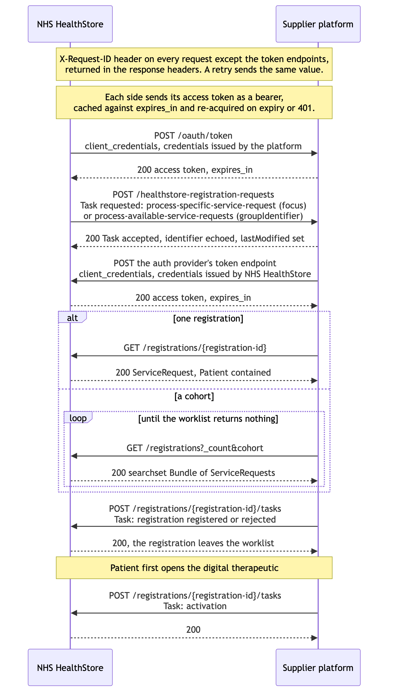

# third-party-platform-patient-registration — proposed design

## Mental model

A clinician prescribes a digital therapeutic (DTx). Where one is prescribed, the
intended mechanism is EPS. That depends on the product being admitted to dm+d,
which is understood to be notionally agreed and remains subject to wider
discussion.

The analogy runs:

| Prescribing | EPS status | This service |
|---|---|---|
| Prescription issued | To be Dispensed | Patient enrolled into HealthStore |
| Pharmacy takes it on | With Pharmacy | Patient registered onto the digital therapeutic platform, which confirms the registration |
| Patient told it is ready | Ready to Collect | Patient notified |
| Patient collects | Collected | Patient opens the digital therapeutic, communicated to HealthStore by the platform as an activation |

## Enrolment and registration

Enrolment is internal to HealthStore and upstream of it. Registration is putting
the patient onto the supplier's platform. The integration with suppliers deals
only in registrations.

## Enrolment methods

Two distinct methods of enrolling patients into HealthStore, with different
timeliness requirements.

| Method | Timeliness |
|---|---|
| Cohort | Registered within a bounded window, at a rate the platform sets. |
| Single patient | Enrolled and registered in real time, potentially while the clinician and patient are together in the consultation. |

Enrolments are released for registration once the cohort has closed upstream.
Whether membership is then fixed is an open question, and the answer decides
whether one registration request per cohort reaches everyone in it.

## Agreed

- FHIR constructs throughout.
- The registration request that goes out is a Task.
- The registration payload is a ServiceRequest. This holds whether the exchange
  is push or pull.
- The lifecycle events that come back are Tasks.
- Only the subset of ServiceRequest states this flow uses is modelled. The
  supplier never transitions them; HealthStore owns the ServiceRequest.
- The response to a Task submitted to HealthStore concerns the Task, not the
  registration. It answers two questions:
  - Is the Task well formed, with its required fields present and valid?
  - Does it relate to a registration that exists and was issued?
- Lifecycle Tasks give `status` from the FHIR set and the domain state in
  `businessStatus`. Registered, rejected, activated and deactivated are
  business states, not FHIR ones.
- HealthStore is lenient about sequence. A Task that arrives out of order, or
  without the one that would normally precede it, is recorded rather than
  refused. Only a malformed Task or an unknown identifier is refused.
- Registration lifecycle is reported against the ServiceRequest, not against the
  registration request. Registered, rejected, activated and deactivated hold
  whether or not a registration request ever reached the platform.
- The retry schedule is HealthStore's own. The bounds on it are not.

## The flow

1. HealthStore sends the platform a registration request. The response is
   recorded, and may drive a retry.
2. The platform retrieves the registrations it names, from the Registrations
   API.
3. The platform submits a Task reporting the registration registered or rejected.
4. Subsequent use of the digital therapeutic produces a Task representing
   activation.

The registration request contains no clinical content, only enough to say what to
retrieve. Neither case identifies the patient; the identifier is the
registration's.

| Registration method | What the request names |
|---|---|
| Cohort | A cohort identifier. The platform retrieves at a rate it sets |
| Single patient | The one registration. The platform retrieves straight away, fast enough to sit inside the consultation |

## Consent

Reporting a registration as registered signals to HealthStore that the patient is
able to access the digital therapeutic. It asserts nothing about what the platform
holds.

What a platform stores of the ServiceRequest is its own implementation detail. A
platform may report the registration registered on receiving the registration
request, and defer retrieving and persisting it in full until the patient first
opens the app.

A platform deferring the retrieval must still be able to relate the patient
first logging into the app to a ServiceRequest.

## Extended lifecycle

Only partly settled. What remains is in `open-questions-and-decisions.md`,
including whether HealthStore signals de-registration outbound and in what form,
whether de-registration removes one registration or the patient's account, and
whether natural completion of a course is the same signal.

**De-registration** means the patient is no longer able to access the digital
therapeutic. It is not an instruction to delete. What the platform does with what
it already holds, clinical records in particular, is its own, on the same basis as
consent.

**Reporting it.** A Task against the ServiceRequest with `businessStatus`
`deactivated`, as registration and activation are reported. This holds whether the
platform initiated it or HealthStore did. The platform reports; it does not alter
the ServiceRequest.

**Irreversible.** A de-registered registration is not reinstated. Putting the same
patient back onto the same product is a new registration with a new registration
identifier.

## Elsewhere
Resources and paths are in `resources.md`. FHIR resources and fields are in `fhir.md` - more to come.
