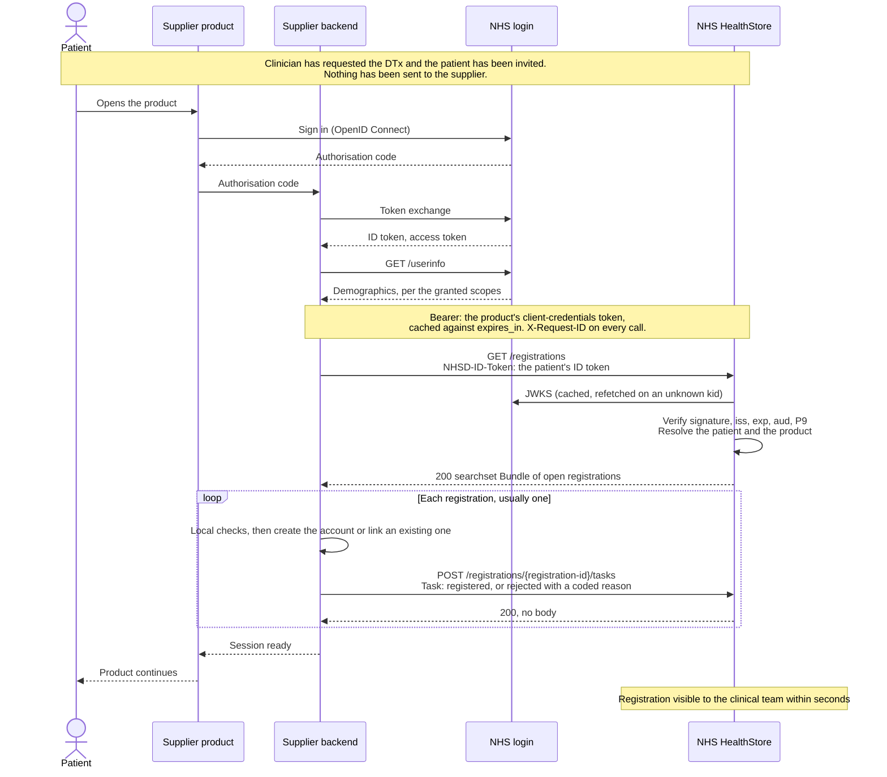

# Design overview

Registration API v1.0 baseline. Supersedes the v0.1 draft in full; the
changes and their reasons are in [`change-log.md`](change-log.md).

## Mental model

A clinician prescribes a digital therapeutic (DTx). Where one is prescribed, the
intended mechanism is EPS. That depends on the product being admitted to dm+d,
which is understood to be notionally agreed and remains subject to wider
discussion.

The analogy runs:

| Prescribing | EPS status | This service |
|---|---|---|
| Prescription issued | To be Dispensed | Patient enrolled into HealthStore |
| Pharmacy takes it on | With Pharmacy | Patient registered onto the digital therapeutic platform, which confirms the registration |
| Patient told it is ready | Ready to Collect | Patient notified |
| Patient collects | Collected | Patient opens the digital therapeutic and signs in, at which point the registration completes |

## Enrolment and registration

Enrolment is internal to HealthStore and upstream of it. Registration is putting
the patient onto the supplier's platform. The integration with suppliers deals
only in registrations.

## The synchronous model in ten lines

1. A clinician requests a DTx for a patient in the request tool. Single patient
   or bulk list; bulk stays on the HealthStore side.
2. The patient is invited via NHS App message or SMS. Nothing is sent to the
   platform at this point. The patient sees a button for your app on the HealthStore page
3. The patient taps to open your app and signs in with NHS login. Your platform's
   existing integration, unchanged.
4. Your platform's backend calls NHS login `/userinfo` and receives the
   patient's demographics, verified at source.
5. On every NHS login sign-in, your platform's backend calls
   `GET /registrations` with the patient's NHS login ID token in the
   `NHSD-ID-Token` header.
   HealthStore verifies the token and returns the
   patient's open registrations: four fields each, plus the interim
   demographics until the platform's NHS login scopes are granted.
6. The platform runs its local checks and acknowledges each registration,
   registered or rejected with a coded reason, seconds later, in the same
   sign-in.
7. Registered means registered: the patient continues in the product, and
   usage reporting proceeds per registration identifier.
8. A registration stays open until acknowledged, and is returned at every
   sign-in until then.
9. The platform hosts no inbound API, runs no queue, does no polling. Two
   outbound calls.
10. Registration status (invited, not yet signed in, registered, rejected,
    expired) is visible to the requesting clinical team in the request tool,
    including for chase workflows.

**Why the demographics moved.** In v0.1 HealthStore pushed patient
demographics to the DTx platform over a new API. Supplier discovery showed
that almost all of the registration data a platform needs is already
available to it from NHS login, a national service every DTx platform already
integrates. Rather than build and run a second source for the same data, v1.0
has the platform take the demographics from NHS login during the patient's
sign-in. The legal basis for the integration remains direct care throughout.
What remains on this API is what NHS login cannot supply: the details of the
clinician's DTx request, and the patient's administrative gender.

## Design rationale

The v0.1 draft pushed a registration request to a platform-hosted endpoint,
then had the platform pull the registration and push lifecycle Tasks back.
Three reasons were given for push over poll. Each is met more strongly by
the synchronous model.

| v0.1 reason for push | How v1.0 meets it |
|---|---|
| Serve the near-real-time face-to-face need, where polling would add latency inside the consultation | Registration happens at the moment the patient signs in, which is the first moment the product can be used. In the consultation, the patient opens the product and is registered within seconds. There is no interval to wait on, because there is no interval. |
| Avoid pushing patient data into a platform before consent | No patient data moves before the patient has signed in. Demographics arrive through `/userinfo` during that sign-in. HealthStore sends only the details of the clinician's DTx request, and only to a caller that has just proved it holds the patient's session. |
| Avoid third-party integrations depending on a patient clicking something in the NHS App | v1.0 depends on the patient opening the product. That is the act the patient must perform to benefit from the prescription anyway; a registration nobody uses has no value. A patient who has not yet signed in is visible as such to the clinical team, who can chase. |

**One-leg authentication.** Every call is platform to HealthStore. The
platform holds one client credential per product and calls with a bearer
token; the patient's ID token in the `NHSD-ID-Token` header scopes the
response to the patient. The platform issues no tokens, hosts no endpoint, and opens no inbound
route. The two-legged pattern of v0.1, where each side authenticated to the
other, is gone.

## Routes to the product

**Without the NHS App: registered all the same.** The invitation points the
patient at the NHS App, but nothing in the design depends on the patient
going through it. The launch link carries no context, and the DTx platform
retrieves on every NHS login sign-in, so a patient a clinician has requested
a DTx for is registered whether they came through the NHS App or signed in to
the product directly. For a patient with no open registration the retrieve
returns an empty Bundle and nothing else happens. This was raised in review on equality
grounds: a patient who cannot or will not use the NHS App should still be
able to take up the DTx. v1.0 meets it without a separate route.

**Without NHS login: supported in principle, deferred.** A patient may
register with the supplier through the supplier's native sign-up rather than
NHS login, because they cannot complete P9 identity verification, decline to
create an NHS login, never act on the invitation, or are directed there by a
clinician working the way they always have. Today that produces a false
negative: the request tool reports the request unfulfilled while the patient
is using the product, usage is not attributed, and the clinician may chase or
re-prescribe. For patients who cannot reach P9 the native route is not an
alternative. It is their only route, since the NHS App and NHS login journey
is closed to them end to end.

The drivers:

- **Equality and inclusion**, raised in review. P9 excludes a real
  population, and their registrations should be recordable. The native-route
  usage rate is an inclusion metric, not leakage.
- **Clinical truth.** A false "unfulfilled" is worse than an attributed
  lower-assurance registration: it drives duplicate outreach and misinforms
  the clinician.
- **Security invariants.** No arbitrary patient lookup. The supplier's
  native sign-up identity assurance is the status quo for that route, and a
  PDS-traced NHS number with matching date of birth, attested by the
  supplier, adds a second factor to it.
- **Boundary of liability.** Identity assurance on the native route belongs
  to the supplier's own DAPB3051 assessment and its PDS tracing obligations.
  HealthStore's exposure is the retrieval itself, controlled by attestation,
  rate limits and a provenance flag. The P9 requirement for HealthStore's own
  surfaces is unaffected.

The capability follows as a versioned change, once private beta has measured
the demand: the rate at which registrations expire unretrieved, and
supplier-reported counts of native sign-ups that could not be matched to a
request. `registration_basis` is reserved from v1.0 so that a registration's
provenance, NHS login token or supplier attested, can be surfaced to the
requesting clinician without a breaking change.

## Timeliness

One commitment, for the single-patient case that matters most.

| Measure | Commitment |
|---|---|
| HealthStore processing per call, retrieve and acknowledge | Proposed p95 < 1 s. Ratification with suppliers from 28 September 2026 |
| Registration visible to the requesting clinical team | Within seconds of the patient's sign-in |

There is no cohort path on this API and no cohort timeliness figure. Bulk
requests are intake-side; each patient in a bulk list is registered
individually at their own first sign-in.

## Agreed

The constructs the exchange is built from.

- FHIR constructs for everything that is a resource. The retrieve request has
  no body at all: the patient is named by the `NHSD-ID-Token` header, not by
  request content.
- The registration payload is a `ServiceRequest` profiled on
  UKCore-ServiceRequest, carrying four data-bearing fields, plus the interim
  demographics. See
  [`fhir.md`](fhir.md).
- The acknowledgement is a lifecycle `Task` against the registration, on the
  same path and in the same shape as v0.1. `Task.status` describes the Task;
  `businessStatus` gives the registration's state, registered or rejected;
  `statusReason` gives the coded reason.
- HealthStore owns the `ServiceRequest`. The platform never transitions it;
  it reports through Tasks.
- Retrieval is read-only. A registration stays open until acknowledged and is
  returned at every sign-in until then. There is no deadline and nothing to
  revert.
- Repeats are no-ops. A Task for a registration already acknowledged with the
  same `businessStatus` returns `200` and changes nothing.
- Tolerant reader. A platform ignores response elements it does not
  recognise. Additions are additive and non-breaking; nothing is renamed or
  repurposed within a major version.
- The payload contract is change-controlled from v1.0. Platforms build
  against tags, not branches.

## The flow

```mermaid
sequenceDiagram
    actor Patient
    participant App as Supplier product
    participant Backend as Supplier backend
    participant NHSLogin as NHS login
    participant HealthStore as NHS HealthStore

    Note over Patient,HealthStore: Clinician has requested the DTx and the patient has been invited.<br/>Nothing has been sent to the supplier.

    Patient->>App: Opens the product
    App->>NHSLogin: Sign in (OpenID Connect)
    NHSLogin-->>App: Authorisation code
    App->>Backend: Authorisation code
    Backend->>NHSLogin: Token exchange
    NHSLogin-->>Backend: ID token, access token
    Backend->>NHSLogin: GET /userinfo
    NHSLogin-->>Backend: Demographics, per the granted scopes

    Note over Backend,HealthStore: Bearer: the product's client-credentials token,<br/>cached against expires_in. X-Request-ID on every call.

    Backend->>HealthStore: GET /registrations<br/>NHSD-ID-Token: the patient's ID token
    HealthStore->>NHSLogin: JWKS (cached, refetched on an unknown kid)
    HealthStore->>HealthStore: Verify signature, iss, exp, aud, P9<br/>Resolve the patient and the product
    HealthStore-->>Backend: 200 searchset Bundle of open registrations

    loop Each registration, usually one
        Backend->>Backend: Local checks, then create the account or link an existing one
        Backend->>HealthStore: POST /registrations/{registration-id}/tasks<br/>Task: registered, or rejected with a coded reason
        HealthStore-->>Backend: 200, no body
    end

    Backend-->>App: Session ready
    App-->>Patient: Product continues

    Note over HealthStore: Registration visible to the clinical team within seconds
```

The same diagram is in [`registration-sequence.mmd`](registration-sequence.mmd)
and rendered as [`registration-sequence.png`](registration-sequence.png).

## What registration asserts

Reporting a registration as `registered` signals to HealthStore that the
patient has signed in to the product with NHS login and holds an account that
can use the requested intervention. Because the Task can only be sent from
inside the patient's authenticated session, `registered` proves the sign-in.
v0.1's `registered` proved neither.

What a platform stores of the `ServiceRequest` is its own implementation
detail. It must hold the registration identifier against the account, since
that keys acknowledgement and usage reporting, and it is how a platform tells a
retry from a new registration.

### Retry and duplicate

The registration identifier decides.

- **The same identifier is seen again**, because the platform failed between
  its account write and the Task, or the patient signed in on two devices, or
  a call was retried. The platform finds the identifier it already stored and
  sends `registered` again. HealthStore treats the repeat as a no-op.
- **A different identifier arrives for a patient the platform already holds
  on that intervention.** The platform links the existing account and sends
  `registered` with `statusReason` `already-registered`. That is a success;
  the registration is fulfilled. HealthStore correlates by NHS number and
  intervention, and can surface a duplicate to the clinician or record an
  account that predates the flow. Never used for a retry.

## Lifecycle

v1.0 covers registration: `registered` and `rejected`. Activation,
deactivation with coded closure reasons, off-boarding and retraction follow as
a versioned change on the same path. See [`lifecycle.md`](lifecycle.md).

## Elsewhere

Resources, authentication, errors and rate limits are in
[`resources.md`](resources.md). FHIR resources and fields, and what comes from
NHS login instead, are in [`fhir.md`](fhir.md). What changed from v0.1 and why
is in [`change-log.md`](change-log.md). The v0.1 open questions are archived in
[`open-questions-and-decisions.md`](open-questions-and-decisions.md).
